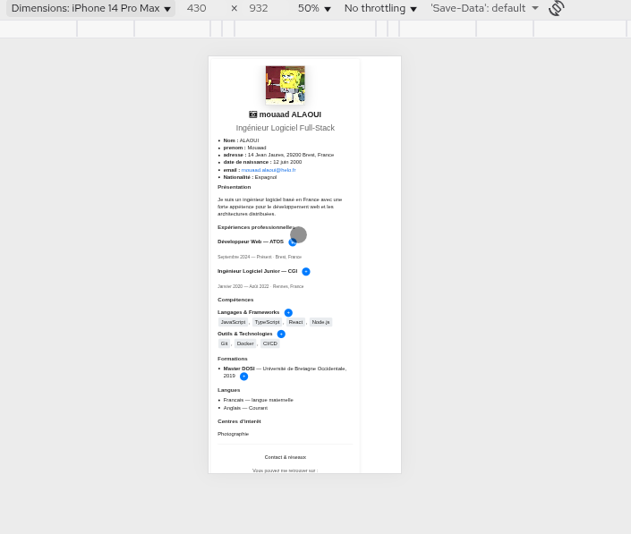

# TP - Javascript 

## 1-apparition des descriptions detaillees 

ajouter l'apparition des descriptions detaillees lors de l'appui sur le bouton + :

**etapes realisees :**

- ajout de boutons "+" interractifs dans les section experiences, competences et Formation
-creation des divs cachees contenant les descriptions detaillees 
- implementationdu  css pour styler les bouton et les zones de details

Modifier le fonctionement pour faire aparaitre une seule descriptions a la fois :

- quand une nouvelle description s'ouvre, toutes les autre se ferment automatiquement

Modifier l'apparition pour qu'elle soit progressive avec croissance lentement jusqu'a la taille normale :
- animation de la hauteur de l'element de 0 a sa taille naturelles

**etapes realisees :**

- ajout de la classe css `expanding` pour l'etat intermediaire d'animation
- implementation de `openDetailsWithAnimation()` avec mesure de `scrollHeight`
- Animation progressivesur 500ms avec 25 etapes (interval de ~20ms)  

resultat : 

## 4-apparition de tooltip sur les competences

ajouter l'apparition d'une description detaillee lors du passage de la souris sur une competence :

- celle ci doit s'afficher sous forme d'une zone de texte (tooltip)
- le tooltip apparait en dessous de la competence au survol
- disparait quand la souris quitte la competence

**etapes realisees :**

- ajout d'attribut `data-tooltip` sur chaque competence avec les details
- creation de span avec classe `skill-item` pour chaque competences
- implementation du css pour styliser les tooltip avec position absolute
- javascript pour creer dynamiquement les element tooltip au chargement
- utilisation de `document.getElementsByClassName()` pour recuperer les competences
- utilisation de `getAttribute()` pour recuperer le text du tooltip
- evenement `mouseenter` et `mouseleave` pour afficher/masquer les tooltip
- animation progressive avec `setTimeout()` pour l'apparition du tooltip
- fonction `showTooltipWithAnimation()` pour faire apparaitre progressivement
- fonction `hideTooltipWithAnimation()` pour masquer progressivement

**technologies utilisees :**

- attribut HTML `data-tooltip` pour stocker les informations
- `createElement()` pour creer dynamiquement les element tooltip
- `appendChild()` pour ajouter les tooltip aux competence
- `setTimeout()` pour l'animation progressive de l'opacite
- manipulation de `style.opacity` et `style.visibility`
- positionnement CSS absolute pour placer les tooltip

### tooltip qui suit le curseur

modifier le fonctionnement pour que la tooltip suive le curseur de la souris au lieu de rester fixe :

- le tooltip doit suivre le mouvement de la souris en temps reel
- il se deplace fluidement avec le curseur
- reste visible tant que la souris est sur la competences

**etapes realisees :**

- Ajout de l'eveneent `mousemove` sur chaquecompetence poure detecter le mouvement
- Creation de la fonction `updateTooltipPosition()` pour maj la position

### deploiement et test sur terminal tactile

Faire un tag "description" et deployer le cv sur gitlab puis l'afficher sur un terminal tactile :

**etapes realisees :**

- creation du tag `description` avec git
- commande : `git tag description`
- push du tag vers gitlab : `git push origin description`
- deploiement du cv sur gitlab pages ou serveur
- test sur un terminal tactile (tablette, iphone...)

**observation sur le tooltip :**

sur un terminal tactile, on note plusieur problemes :

- le tooltip ne s'affiche pas correctement car il n'y a pas de curseur de souris
- le tooltip est concu pour suivre un curseur qui n'existe pas sur tactile

## 5-auto-evaluation des connaissances

afficher une auto-evaluation des connaissances techniques avec un systeme d'etoiles :

- pour chaque competence technique, afficher un niveau de maitrise
- entre 1 etoile pour connaissance basique et 5 etoiles pour expertise
- les etoiles permette de visualiser rapidement le niveau

**etapes realisees :**

- ajout de l'attribut `data-level` sur chaque competence avec valeur entre 1 et 5
- niveaux choisi : JavaScript (4★), TypeScript (3★), React (4★), Node.js (3★), Git (5★), Docker (3★), CI/CD (2★)
- creation d'une fonction javascript pour generer dynamiquement les etoiles
- utilisation des caractere unicode : ★ (etoile pleine) et ☆ (etoile vide)
- boucle pour comparer le niveau et afficher les etoile correspondante
- creation d'un element `` pour contenir les etoiles
- ajout avec `appendChild()` a chaque competence
- ajout du CSS pour styliser les etoile en couleur doree (#ffc107)
- espacement entre les etoile avec `letter-spacing`

**technologies utilisees :**

- attribut HTML `data-level` pour stocker le niveau (1-5)
- caracteres unicode ★ et ☆ pour les etoiles
- `getAttribute('data-level')` pour recuperer le niveau
- boucle `for` pour generer les 5 etoiles
- condition `if(j<=level)` pour determiner si etoile pleine ou vide
- `createElement('span')` pour creer le conteneur d'etoiles
- `innerHTML` pour ajouter les etoiles en HTML
- CSS pour couleur doree et espacement

