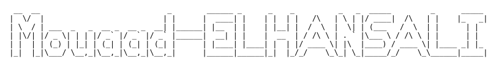
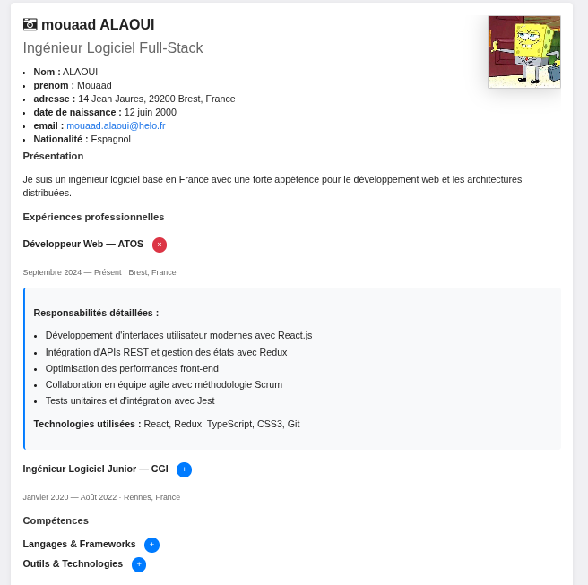
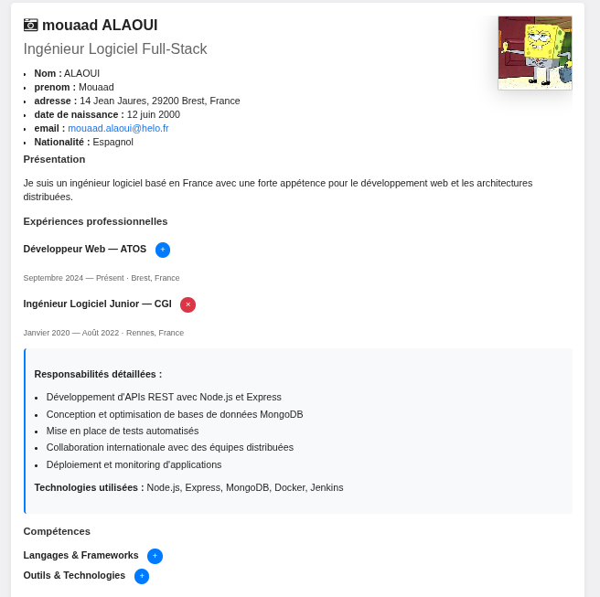
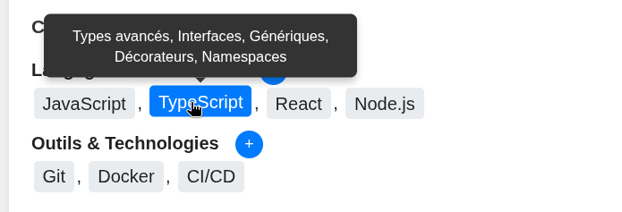

# TP - Javascript 

## 1-apparition des descriptions detaillees 

ajouter l'apparition des descriptions detaillees lors de l'appui sur le bouton + :

**etapes realisees :**

- ajout de boutons "+" interractifs dans les section experiences, competences et Formation
-creation des divs cachees contenant les descriptions detaillees 
- implementationdu  css pour styler les bouton et les zones de details

Modifier le fonctionement pour faire aparaitre une seule descriptions a la fois :

- quand une nouvelle description s'ouvre, toutes les autre se ferment automatiquement

Modifier l'apparition pour qu'elle soit progressive avec croissance lentement jusqu'a la taille normale :
- animation de la hauteur de l'element de 0 a sa taille naturelles

**etapes realisees :**

- ajout de la classe css `expanding` pour l'etat intermediaire d'animation
- implementation de `openDetailsWithAnimation()` avec mesure de `scrollHeight`
- Animation progressivesur 500ms avec 25 etapes (interval de ~20ms)  

resultat : 

## 4-apparition de tooltip sur les competences

ajouter l'apparition d'une description detaillee lors du passage de la souris sur une competence :

- celle ci doit s'afficher sous forme d'une zone de texte (tooltip)
- le tooltip apparait en dessous de la competence au survol
- disparait quand la souris quitte la competence

**etapes realisees :**

- ajout d'attribut `data-tooltip` sur chaque competence avec les details
- creation de span avec classe `skill-item` pour chaque competences
- implementation du css pour styliser les tooltip avec position absolute
- javascript pour creer dynamiquement les element tooltip au chargement
- utilisation de `document.getElementsByClassName()` pour recuperer les competences
- utilisation de `getAttribute()` pour recuperer le text du tooltip
- evenement `mouseenter` et `mouseleave` pour afficher/masquer les tooltip
- animation progressive avec `setTimeout()` pour l'apparition du tooltip
- fonction `showTooltipWithAnimation()` pour faire apparaitre progressivement
- fonction `hideTooltipWithAnimation()` pour masquer progressivement

**technologies utilisees :**

- attribut HTML `data-tooltip` pour stocker les informations
- `createElement()` pour creer dynamiquement les element tooltip
- `appendChild()` pour ajouter les tooltip aux competence
- `setTimeout()` pour l'animation progressive de l'opacite
- manipulation de `style.opacity` et `style.visibility`
- positionnement CSS absolute pour placer les tooltip

## Apparition des descriptions detaillees 